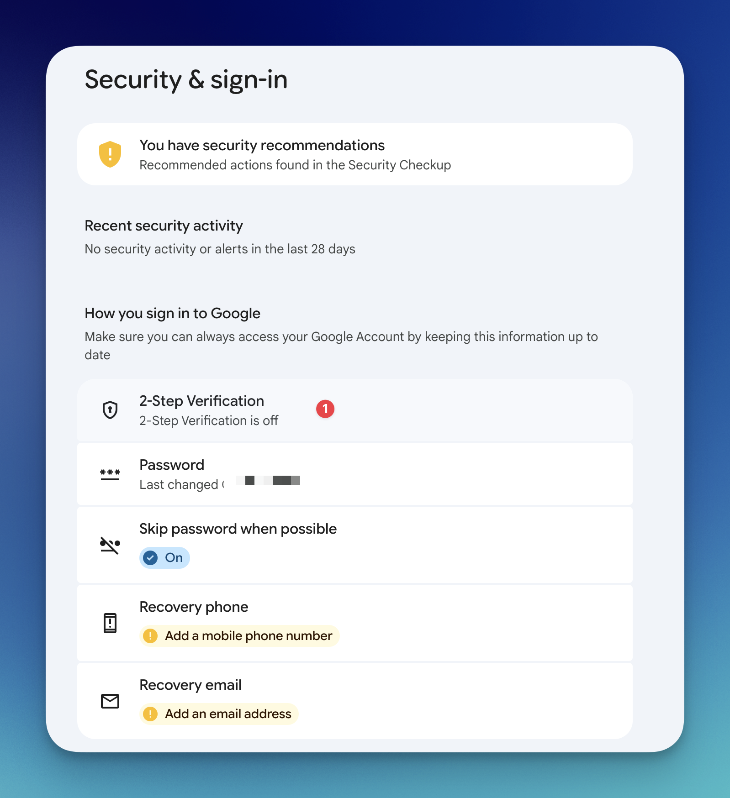
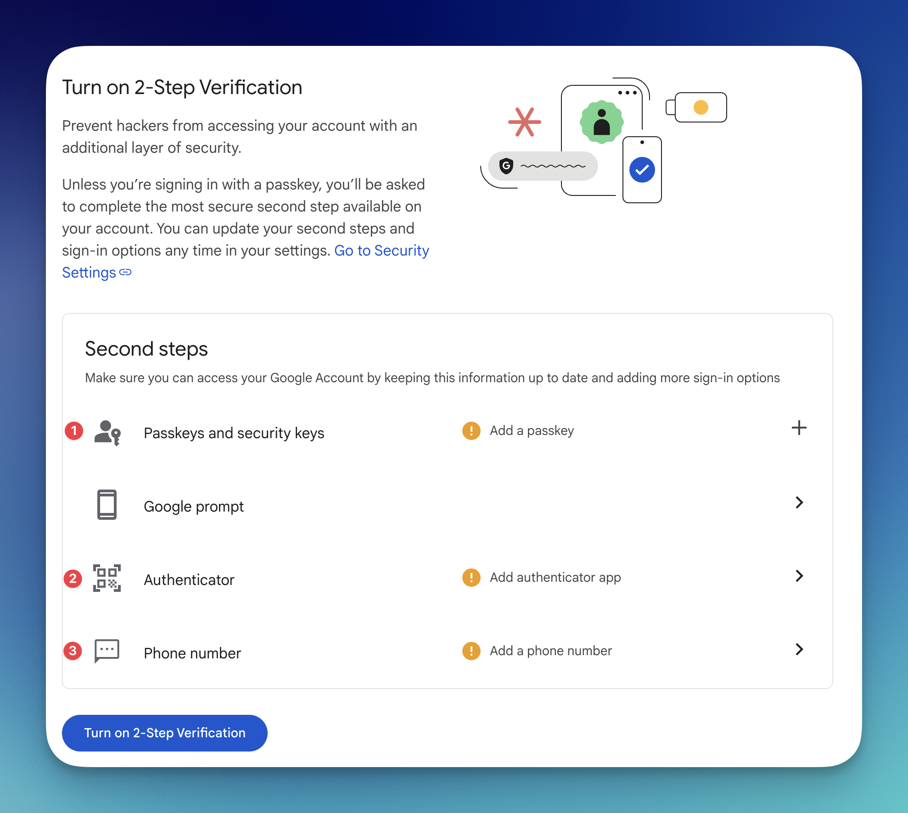
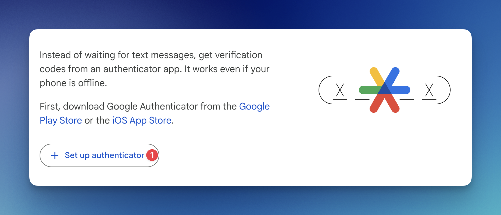
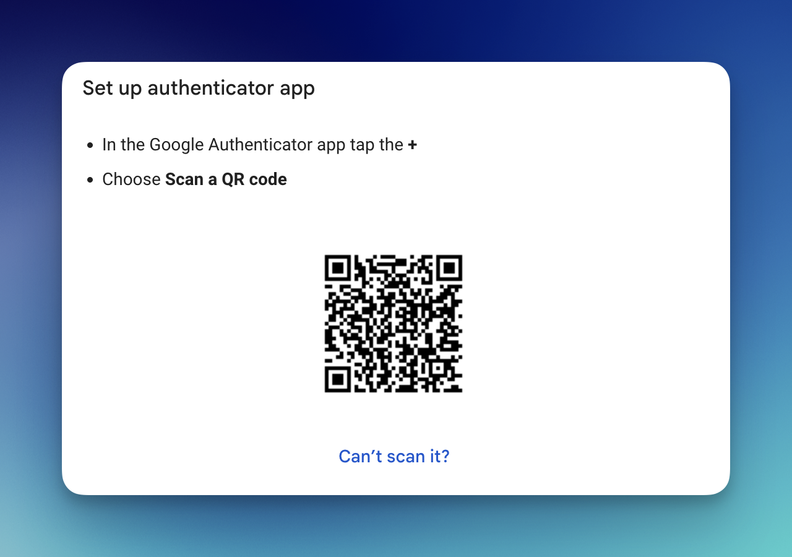
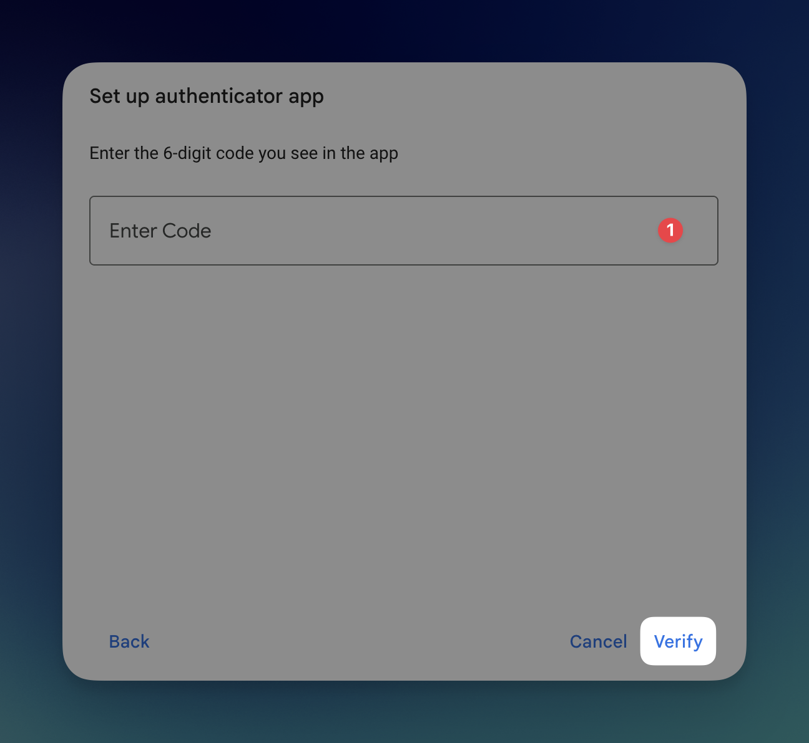
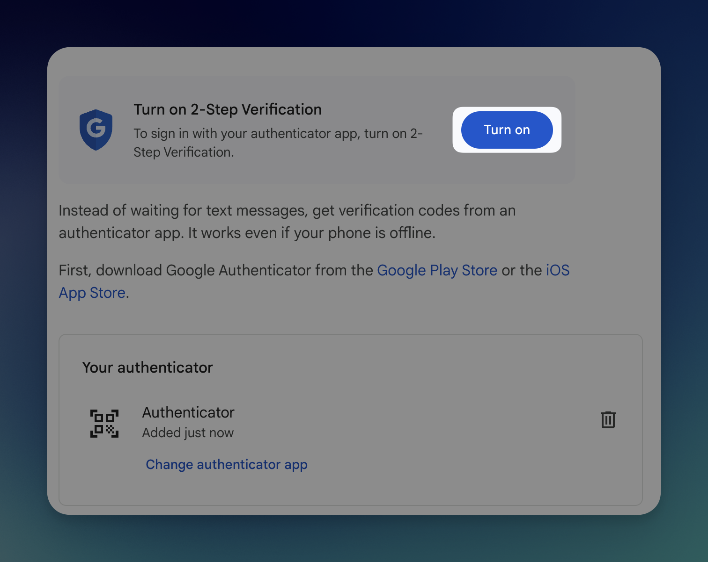

# Defining Multi-Factor Authentication (MFA) for Your Google Cloud Account

This guide walks you through the steps to enable Multi-Factor Authentication (MFA) for your Google Cloud account in a simple and secure way.

---

## 1. Visit the Google Account Security Page

Go to your Google Account [Security page](https://myaccount.google.com/security).
On this page, locate and click the **2-Step Verification** section.

---

## 2. Choose Your MFA Method

On the 2-Step Verification page, you can select the MFA method you prefer.
Available options include **Passkeys**, **Authenticator apps**, or **SMS-based phone verification**.

---

## 3. Set Up an Authenticator App

In this example, we will configure an authenticator app.

Click the **Set up authenticator** button.

A QR code will be generated. Scan this QR code using an authenticator application such as **Google Authenticator**, **Authy**, or a similar app on your mobile device.

After scanning the QR code, the authenticator app will generate a one-time verification code.
Enter this code and click **Verify** to complete the setup.

---

## 4. Enable 2-Step Verification

Once the authenticator is successfully verified, you can enable MFA by clicking the **Turn on** button.

---

### ✅ Done!

Multi-Factor Authentication is now enabled for your Google Cloud account, significantly improving the security of your account.
